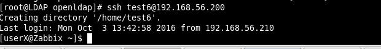
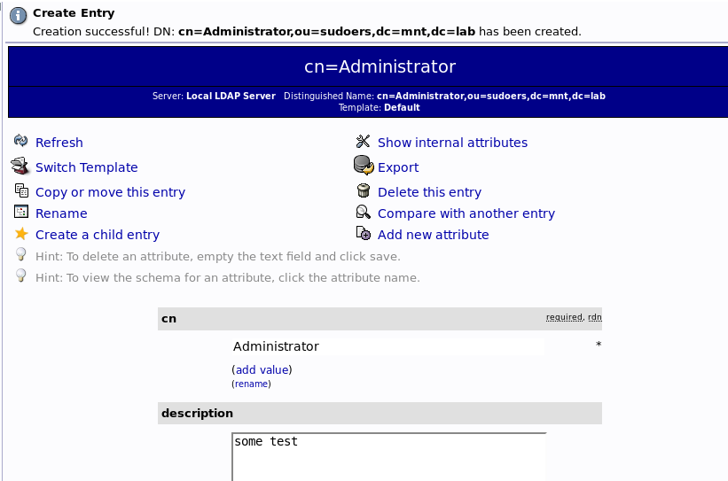

MTN.*NIX.11 LDAP
---

***Student***: [Uladzislau Charches](https://upsa.epam.com/workload/employeeView.do?employeeId=4060741400038705754#emplTab=general)

# LDAP TASK 3

**1. I need to add to sudoers using wheel**

:
on server:

    vim wheel.ldif
    ldapadd -x -D "cn=admin,dc=mnt,dc=lab" -W -f ./wheel.ldif
    service slapd restart

on client:

    echo '%wheel ALL=(ALL) ALL' > /etc/sudoers.d/wheel
    chmod 0440 /etc/sudoers.d/wheel

###

**2. Added to sudoers OU**

**Added on server:**

- vim /etc/openldap/slapd.conf

*include /usr/share/doc/sudo-1.8.6p7/schema.OpenLDAP

- slaptest -f /etc/openldap/slapd.conf
- service slapd restart

Created “sudouers” organizational unit.

Created SUDO Role in sudoers branch

On web-UI

**3. Added public key to user** 

On client

- yum install -y openssh-ldap nss-pam-ldapd
- vim /etc/ssh/sshd_config

*PubkeyAuthentication yes
*AuthorizedKeysCommand /usr/libexec/openssh/ssh-ldap-wrapper
*AuthorizedKeysCommandRunAs nobody

- sshd -t

- vim /usr/libexec/openssh/ssh-ldap-wrapper

*#!/bin/sh
*exec /usr/libexec/openssh/ssh-ldap-helper -d -e -v -s "$1"

- chmod 755 /usr/libexec/openssh/ssh-ldap-wrapper

- vim /etc/ssh/ldap.conf

*ldap_version 3
*bind_policy soft

*binddn cn=admin,dc=mnt,dc=lab -id
*bindpw test -pass
*ssl no
*ssl start_tls
*tls_reqcert never

tls_cacertdir /etc/openldap/cacerts
*host 192.168.56.210 -server ip
*port 389
*base dc=mnt,dc=lab

- service sshd restart
- sh /usr/libexec/openssh/ssh-ldap-wrapper username to check

Additional files:

[wheel.ldif](wheel.ldif)

**Screenshots**

