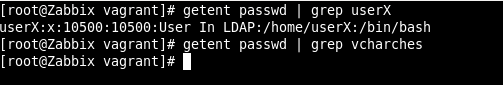
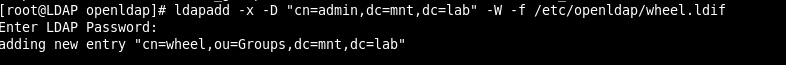
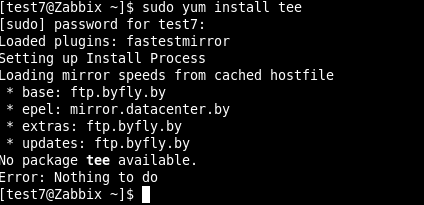
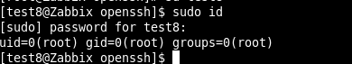

MTN.*NIX.11 LDAP
---

***Student***: [Uladzislau Charches](https://upsa.epam.com/workload/employeeView.do?employeeId=4060741400038705754#emplTab=general)

# LDAP TASK 2

**1. I need to configure audit logging**

First of all I created folder /var/log/ldap
With parameteres:
 
 chmod 744 ldap

 chown ldap.ldap ldap/

### Audit Log

moduleload auditlog.la

overlay auditlog

auditlog /var/log/ldap/audit.log

###

**2. Added password policy and memberof**

moduleload memberof.la

overlay memberof

moduleload ppolicy.la

overlay ppolicy

ppolicy_default "cn=default,ou=policies,dc=mnt,dc=lab"

ppolicy_use_lockout

ppolicy_hash_cleartext

My [slapd.conf](ldif_files/slapd.conf)

Restart service slapd

Create policy: my file - [password_policy.ldif](ldif_files/password_policy.ldif)

ldapadd -x -D "cn=admin,dc=mnt,dc=lab" -W -f /etc/openldap/password_policy.ldif

**3. I added Org.unit services [services.ldif](ldif_files/services.ldif) after it I**

Created groups Linux and Zabbix and 

[linux_group.ldif](ldif_files/linux_group.ldif)

[zabbix_group.ldif](ldif_files/zabbix_group.ldif)

Added users into these groups.

[userX.ldif](ldif_files/userX.ldif)

[ucharches.ldif](ldif_files/ucharches.ldif)

Testing memberof  cn_zabbix

ldapsearch -h localhost -D "cn=admin,dc=mnt,dc=lab" -W -b "dc=mnt,dc=lab" 'memberOf=cn=Zabbix,ou=Services,dc=mnt,dc=lab'

**4. In Zabbix server:**

yum install -y php-ldap

service httpd restart

Connect to Zabbix as Suepr_admin
Create new user with the same name as ldap user. On the tab add Permissions to created user.

Click "Save"

Logout

Connect to Zabbix as newuser

Go to Administration - Authentication - LDAP

And connect to ldap. Example in screens.

**5. Installation of ldap-client**

yum install -y openldap-clients nss-pam-ldapd pam_ldap nscd rpcbind authconfig

sudo authconfig --enableldap --enableldapauth --ldapserver=ldap://192.168.56.210/ --ldapbasedn=dc=mnt,dc=lab --disablefingerprint --kickstart --enablemkhomedir

Connect to ldap-client from another vm (result in screens)

after it I created filter 

nano  /etc/nslcd.conf

filter passwd (&(objectClass=posixAccount)(memberOf=cn=Linux,ou=Groups,dc=mnt,dc=lab))

- service nslcd restart

and Checked:  

**Screenshots**

